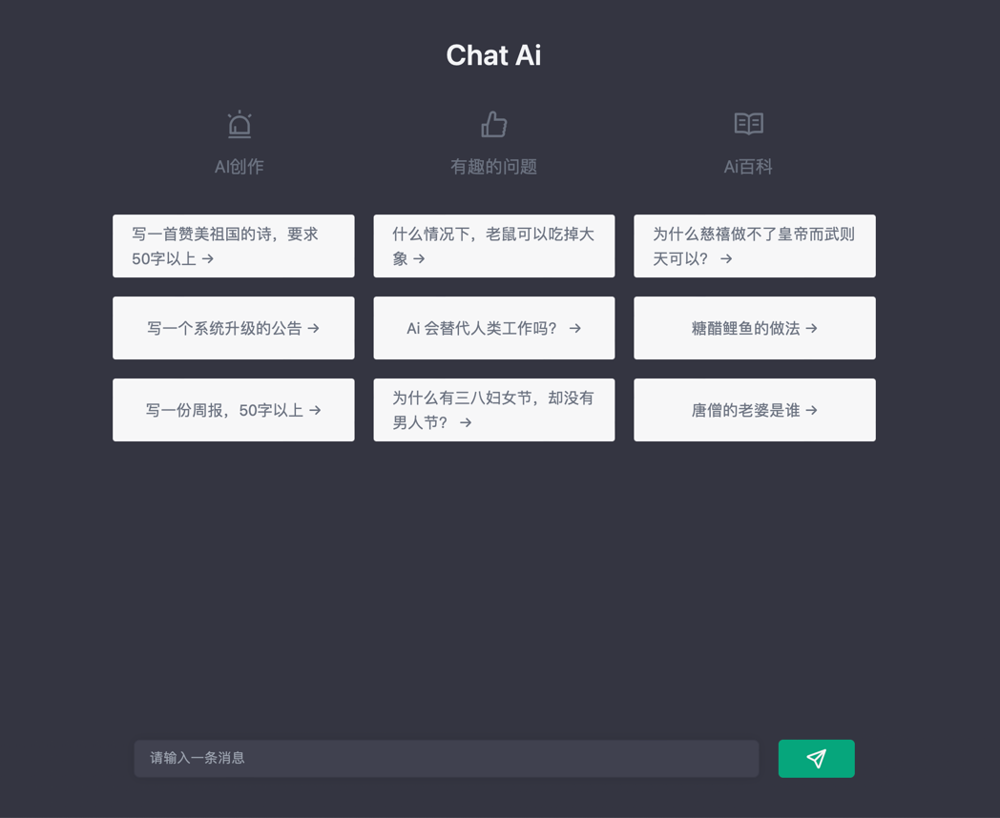

# cs-magic-frontend

## todo

- [ ] fix 未登录时无限加载聊天界面
- [ ] 增加未登录时消息返回的引导
- [ ] P1, 增加默认聊天界面消息提示（chatgpt, dalle), like 
- [ ] 邮箱垃圾机制研究
- [ ] 调研 pr 点赞问题
- [ ] P1, resolve https://cs-magic.com/wall-messages --> http://cs-magic.com/backend/v1/wall-messages/
- [ ] P1, add bills history
- [ ] P2, trailing slash nginx 307问题
- [ ] P2, strict mode on typing
- [ ] P2, dispatch after fetch (to avoid use thunk)
- [ ] P2, use `react-query` to simplify conversations/messages dynamic fetch upon adding
- [ ] P2, enable `noreply@cs-magic.com`
- [ ] P3, 允许密码登录
- [ ] P3, 浏览器水印指纹库在arc中无法使用

## finished todo

- [x] P2, 解决验证码设计问题
- [x] （不明）P1, 上传头像后加载动画并锁定
- [x] P1, signIn 在火狐与手机上会失败。解决方案：添加 `e.preventDefault()`即可
- [x] P1, better conversation id design in page
- [x] P2, support code render
- [x] P1, support auto scroll
