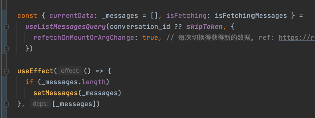

## typewriter-effect

ref: https://github.com/topics/typewriter-effect

### typeit

- ref: https://github.com/alexmacarthur/typeit/tree/master
- 缺点：
    - react的封装没有提供 直接 hide cursor after completion 的功能
    - 代码写的不够好，比如`typeit/src/types/CursorOptions`内有些类显示没有

## wechaty

### import

要用 `esm` 的导入

### puppets

ref: https://github.com/wechaty/puppet-wechat

### puppet-provider: wechaty-puppet-wechat4u

`wechaty-puppet-wechat4u` 这是桌面版微信，不需要token，还行！

ref: https://wechaty.js.org/docs/puppet-providers/wechat4u

### puppet-provider: paimon

我的订单 - chatools平台, http://120.55.60.194/#/order

## typescript relative

### get component type

```ts
type ViewProps = React.ComponentProps<typeof View>
```

ref: https://stackoverflow.com/a/55005902/9422455

## sse

参考资料如下：

Server-sent events - Web APIs | MDN, https://developer.mozilla.org/en-US/docs/Web/API/Server-sent_events

@microsoft/fetch-event-source - npm, https://www.npmjs.com/package/@microsoft/fetch-event-source

Streaming Updates | Redux
Toolkit, https://redux-toolkit.js.org/rtk-query/usage/streaming-updates#when-to-use-streaming-updates

Custom Response - HTML, Stream, File, others -
FastAPI, https://fastapi.tiangolo.com/advanced/custom-response/#streamingresponse

How to use server-sent events (SSE) with
FastAPI?, https://devdojo.com/bobbyiliev/how-to-use-server-sent-events-sse-with-fastapi

## 在nextjs导入svg的最佳实践：svgr

ref:https://stackoverflow.com/a/65685418/9422455

## conversation_id null 问题

直接在页面初始化的时候就自动生成一个，然后在组件里直接使用即可

## rtk query relative


rtk query 真地东西好多，有data和currentData之分，这个问题竟然搞了一晚上+一下午才明白……

这个问题trigger的点在于，正常的api设计，会在iSuccess后触发回调，但在rtk
query里，isSuccess之时，只是代表数据请求成功，但数据还没返回（其中data会是原先的数据（留存），currentData则为空）。

直到数据完全接收后，data = currentData = 收回的数据，这时候 isSuccess依旧是true。

这导致如果我们在 useEffect 里 基于 isSuccess 去更新数据状态，会不符合预期。

所以最好的办法，就是给这个 data 生成一个id，然后 dependencies里设置为这个id，（不能直接用data作为dependencies，因为每次都会视为不同，导致无限刷新）。

终极解决方案：

直接监控 currentData 因为它在数据完整获取时为有数据，获取时为空，完美匹配有效数据场景。



主要参考：https://redux-toolkit.js.org/rtk-query/usage/queries#query-hook-options

## markdown relative

### add mdx support

we should use `next.config.mjs` for `remark-gfm` support, ref: https://github.com/vercel/next.js/discussions/36310

## email validation and verification

validation 可以在 client 端完成，但是 verification 需要在 server 端，因为涉及到了 dns

validation 用的最多的库是 `isemail` 或者 `mailcheck`（90,129 ），而 verification 则可以用 node 端的 `deep-email-validator`
（12,164），第三方付费verification则可以参考：

https://geekflare.com/email-verification-api/，例如 [abstractapi](https://app.abstractapi.com/api/email-validation/pricing)
，这个每个月
100 次免费额度，示例如下：

```javascript
              function httpGetAsync(url, callback) {
                  const xmlHttp = new XMLHttpRequest();
                  xmlHttp.onreadystatechange = function() {
                      if (xmlHttp.readyState === 4 && xmlHttp.status === 200)
                      callback(xmlHttp.responseText);
                  }
                  xmlHttp.open("GET", url, true); // true for asynchronous
                  xmlHttp.send(null);
              }

              const url = "https://emailvalidation.abstractapi.com/v1/?api_key=aa10ba0c931c4f5bb4fafcdd1d6a9f38&email=shawninjuly@gmail.com"

              httpGetAsync(url)
```

## animation

- https://www.npmjs.com/package/react-typist, 42377
- https://www.npmjs.com/package/react-type-animation, 12530
- https://www.npmjs.com/package/react-typed, 8956
- https://www.npmjs.com/package/react-typing-effect, 2881

## web communication

### stream response

这里提供了 fetch 的办法去获取流数据：

ref: Using readable streams - Web APIs |
MDN, https://developer.mozilla.org/en-US/docs/Web/API/Streams_API/Using_readable_streams#consuming_a_fetch_using_asynchronous_iteration

## typography relative

### 渲染一些公式之类

不需要这些：`rehype-shiki remark-code-blocks @mapbox/rehype-highlight-code-block`

只需要：

- `react-markdown`, ref: https://www.npmjs.com/package/react-markdown
- `rehype-highlight`, ref: https://github.com/rehypejs/rehype-highlight
- `@tailwindcss/typography`, ref: https://tailwindcss.com/docs/typography-plugin

## flex relative

### `flex-end` 和 `scroll` 矛盾

css - Use justify-content: flex-end and to have vertical scrollbar - Stack
Overflow, https://stackoverflow.com/questions/36130760/use-justify-content-flex-end-and-to-have-vertical-scrollbar

可以使用额外添加一个 `grow` 解决！

参考我们的代码：

## tailwind-css relative

### show sub-element when hovering

ref: https://stackoverflow.com/a/67401616/9422455

## secret

generate secret keys:

```shell
openssl rand -hex 32
```

ref: https://www.tecmint.com/generate-pre-shared-key-in-linux/

## 消息体设计

由于后端的 conversation 其实是不完整的（token超过的时候，会被 truncate），并且只有 role, content
两个字段，达不到前端显示信息完备度的要求，因此消息体选择全部由前端自行存储，后端只存储chatbot的一些内部信息。

具体地，前端需要手动实现 id, user, time, content 等信息，以及自行维护持久化。
